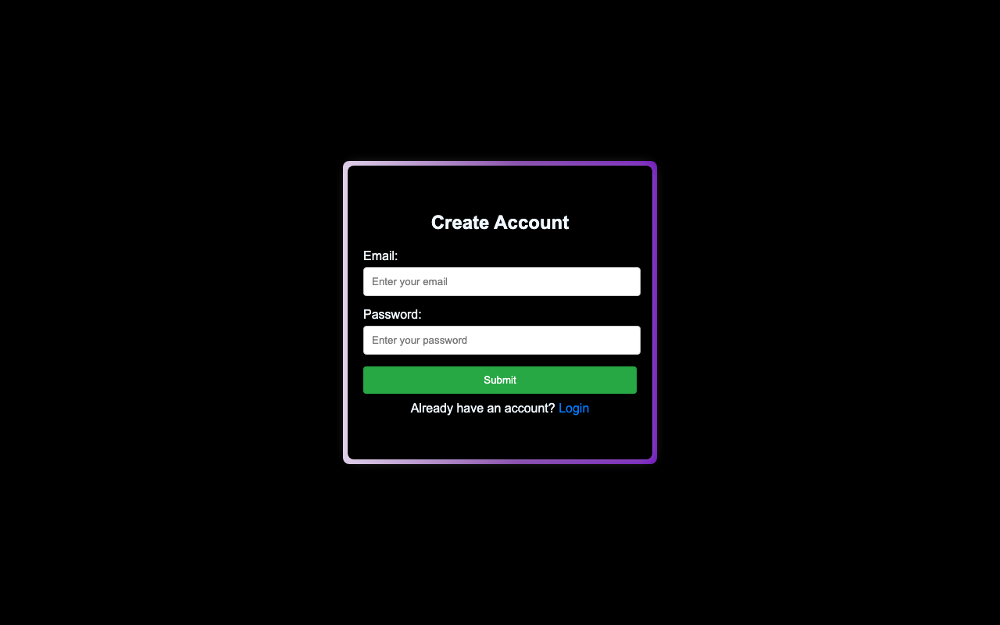
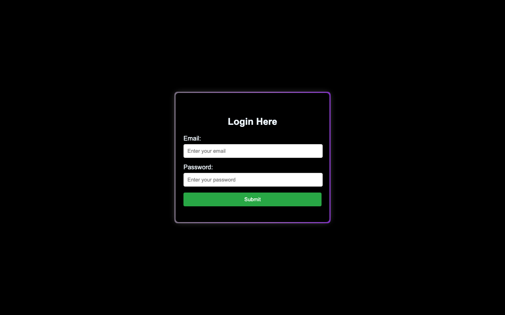
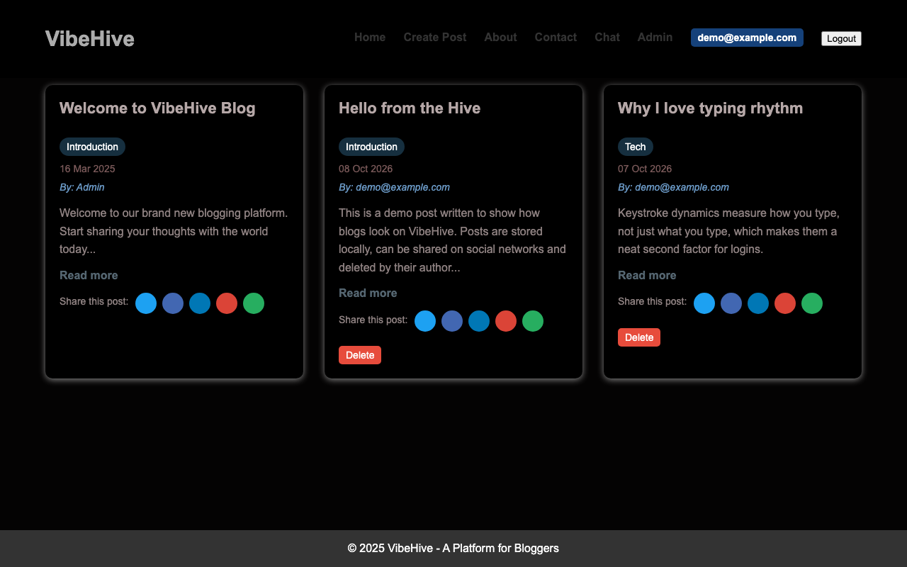

# VibeHive – Social Blogging Made Easy

VibeHive is a web platform where people **chat in real time and publish blogs**. Visitors create an account, sign in, write and share posts, and talk to everyone else in a shared chat room; an admin page manages a list of restricted words.

> This repository documents the project (description, design, screenshots). The source code lives in a private repository, `Vibe-hive_SocialBloggingMadeEasy-code`.

## Screenshots

| Create account | Login |
|---|---|
|  |  |

**Blog feed**, with demo posts, per-post share buttons (X, Facebook, LinkedIn, e-mail, WhatsApp) and delete buttons on the signed-in user's own posts:



_The chat room and admin panel need a live Firebase backend and show real user data, so they are described below instead of pictured._

## Features
- **Accounts**: e-mail and password sign-up and login (minimum 8 characters) through Firebase Authentication.
- **Blogging**: create a post (title, category, description), read the full text with "Read more", share it, and delete your own posts. A welcome post by Admin is always shown.
- **Real-time chat**: a shared room where every message appears instantly for everyone.
- **Admin panel**: add and remove restricted words (defaults are pre-loaded).
- **About page**: introduces the three students who built it.

## How it works
```
start.html (create account) -> login.html -> project.html (blog feed) <-> chat.html
                                                   |-> admin.html
```
1. **Front end**: plain HTML, CSS and vanilla JavaScript (ES modules), a dark UI with animated gradient borders; no build step.
2. **Auth**: `register.js` and `loginjs.js` call Firebase `createUserWithEmailAndPassword` and `signInWithEmailAndPassword`. After login the e-mail is kept in the browser's `localStorage` and the user lands on the blog page.
3. **Blogs**: `script.js` stores posts as JSON under `vibehivePosts` in `localStorage`, rebuilds the cards on every load, and records each shared post under `vibehiveSharedPosts` so a share link (`?post=<id>`) can open it.
4. **Chat**: `chat.js` writes each message (`username`, `email`, `message`, server timestamp) to a Cloud Firestore `chats` collection and subscribes to it with `onSnapshot`, ordered by time, so new messages stream in without refreshing. Your own messages are styled differently from others'.
5. **Admin**: the restricted-words list lives in `localStorage` (`vibehiveRestrictedWords`).

## Tech stack
HTML5, CSS3, JavaScript (ES modules), Firebase Authentication, Cloud Firestore.

## Authors
Karthik B, Sai Sathya Krishna A R, Charan Gnanasekar Geetha.
